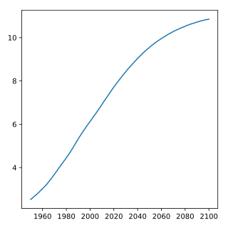
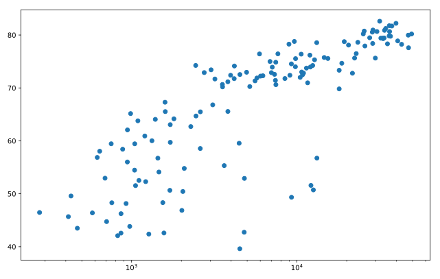
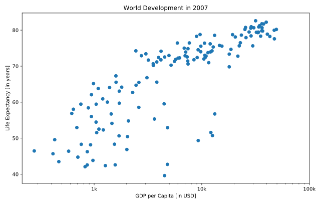

# Course Description

The intermediate python course is crucial to your data science curriculum. Learn to visualize real data with matplotlib's functions and get to know new data structures such as the dictionary and the Pandas DataFrame. After covering key concepts such as boolean logic, control flow and loops in Python, you're ready to blend together everything you've learned to solve a case study using hacker statistics.

中级python课程对您的数据科学课程至关重要。 学习使用matplotlib的函数可视化真实数据，并了解新的数据结构，如字典和Pandas DataFrame。 在覆盖了布尔逻辑，控制流和Python中的循环等关键概念之后，您已准备好将您学到的所有内容混合在一起，以使用黑客统计信息来解决案例研究。

## Matplotlib

Data Visualization is a key skill for aspiring data scientists. Matplotlib makes it easy to create meaningful and insightful plots. In this chapter, you will learn to build various types of plots and to customize them to make them more visually appealing and interpretable.

数据可视化是有抱负的数据科学家的关键技能。 Matplotlib可以轻松创建有意义且富有洞察力的图表。 在本章中，您将学习构建各种类型的绘图并对其进行自定义以使其更具视觉吸引力和可解释性。


###  Basic plots with matplotlib

50 xp


###  Line plot (1)

100 xp

code

```python
# Print the last item from year and pop
print(year[-1])
print(pop[-1])

# Import matplotlib.pyplot as plt
import matplotlib.pyplot as plt

# Make a line plot: year on the x-axis, pop on the y-axis
plt.plot(year, pop)

# Display the plot with plt.show()
plt.show()
```

output

```python
2100
10.85
```

plot


###  Line Plot (2): Interpretation

50 xp

plot



answer

```python
2060
```


###  Line plot (3)

100 xp

code

```python
# Print the last item of gdp_cap and life_exp
print(gdp_cap[-1])
print(life_exp[-1])

# Make a line plot, gdp_cap on the x-axis, life_exp on the y-axis
plt.plot(gdp_cap, life_exp)

# Display the plot
plt.show()
```

output

```python
469.70929810000007
43.487
```

plot


###  Scatter Plot (1)

100 xp

code

```python
# Change the line plot below to a scatter plot
plt.scatter(gdp_cap, life_exp)

# Put the x-axis on a logarithmic scale
plt.xscale('log')

# Show plot
plt.show()
```

plot




###  Scatter plot (2)

100 xp

code

```python
# Import package
import matplotlib.pyplot as plt

# Build Scatter plot
plt.scatter(pop, life_exp)

# Show plot
plt.show()
```

plot


###  Histograms

50 xp


###  Build a histogram (1)

100 xp

code

```python
# Create histogram of life_exp data
plt.hist(life_exp)

# Display histogram
plt.show()
```

plot


###  Build a histogram (2): bins

100 xp

code

```python
# Build histogram with 5 bins
plt.hist(life_exp, bins=5)

# Show and clean up plot
plt.show()
plt.clf()

# Build histogram with 20 bins
plt.hist(life_exp, bins=20)

# Show and clean up again
plt.show()
plt.clf()
```

plot


###  Build a histogram (3): compare

100 xp

code

```python
# Histogram of life_exp, 15 bins
plt.hist(life_exp, bins=15)

# Show and clear plot
plt.show()
plt.clf()

# Histogram of life_exp1950, 15 bins
plt.hist(life_exp1950, bins=15)

# Show and clear plot again
plt.show()
plt.clf()
```

plot


###  Choose the right plot (1)

50 xp

answer

```python
Histogram
```


###  Choose the right plot (2)

50 xp

answer

```python
Scatter plot
```


###  Customization

50 xp


###  Labels

100 xp

code

```python
# Basic scatter plot, log scale
plt.scatter(gdp_cap, life_exp)
plt.xscale('log')

# Strings
xlab = 'GDP per Capita [in USD]'
ylab = 'Life Expectancy [in years]'
title = 'World Development in 2007'

# Add axis labels
plt.xlabel(xlab)
plt.ylabel(ylab)

# Add title
plt.title(title)

# After customizing, display the plot
plt.show()
```

plot


###  Ticks

100 xp

code

```python
# Scatter plot
plt.scatter(gdp_cap, life_exp)

# Previous customizations
plt.xscale('log')
plt.xlabel('GDP per Capita [in USD]')
plt.ylabel('Life Expectancy [in years]')
plt.title('World Development in 2007')

# Definition of tick_val and tick_lab
tick_val = [1000, 10000, 100000]
tick_lab = ['1k', '10k', '100k']

# Adapt the ticks on the x-axis
plt.xticks(tick_val, tick_lab)

# After customizing, display the plot
plt.show()
```

plot




###  Sizes

100 xp

code

```python
# Import numpy as np


# Store pop as a numpy array: np_pop


# Double np_pop


# Update: set s argument to np_pop
plt.scatter(gdp_cap, life_exp, s = pop)

# Previous customizations
plt.xscale('log')
plt.xlabel('GDP per Capita [in USD]')
plt.ylabel('Life Expectancy [in years]')
plt.title('World Development in 2007')
plt.xticks([1000, 10000, 100000],['1k', '10k', '100k'])

# Display the plot
plt.show()
```

plot


code

```python
# Import numpy as np
import numpy as np

# Store pop as a numpy array: np_pop
np_pop = np.array(pop)

# Double np_pop
np_pop = np_pop * 2

# Update: set s argument to np_pop
plt.scatter(gdp_cap, life_exp, s = np_pop)

# Previous customizations
plt.xscale('log')
plt.xlabel('GDP per Capita [in USD]')
plt.ylabel('Life Expectancy [in years]')
plt.title('World Development in 2007')
plt.xticks([1000, 10000, 100000],['1k', '10k', '100k'])

# Display the plot
plt.show()
```

plot


###  Colors

100 xp

code

```python
# Specify c and alpha inside plt.scatter()
plt.scatter(x = gdp_cap, y = life_exp, s = np.array(pop) * 2, c = col, alpha=0.8)

# Previous customizations
plt.xscale('log')
plt.xlabel('GDP per Capita [in USD]')
plt.ylabel('Life Expectancy [in years]')
plt.title('World Development in 2007')
plt.xticks([1000,10000,100000], ['1k','10k','100k'])

# Show the plot
plt.show()
```

plot


###  Additional Customizations

100 xp

code

```python
# Scatter plot
plt.scatter(x = gdp_cap, y = life_exp, s = np.array(pop) * 2, c = col, alpha = 0.8)

# Previous customizations
plt.xscale('log')
plt.xlabel('GDP per Capita [in USD]')
plt.ylabel('Life Expectancy [in years]')
plt.title('World Development in 2007')
plt.xticks([1000,10000,100000], ['1k','10k','100k'])

# Additional customizations
plt.text(1550, 71, 'India')
plt.text(5700, 80, 'China')

# Add grid() call
plt.grid(True)

# Show the plot
plt.show()
```

plot


###  Interpretation

50 xp

answer

```python
The countries in blue, corresponding to Africa, have both low life expectancy and a low GDP per capita.
```

## Dictionaries & Pandas

Learn about the dictionary, an alternative to the Python list, and the Pandas DataFrame, the de facto standard to work with tabular data in Python. You will get hands-on practice with creating, manipulating and accessing the information you need from these data structures.

了解字典，Python列表的替代品以及Pandas DataFrame，这是在Python中使用表格数据的事实标准。 您将亲身体验从这些数据结构中创建，操作和访问所需的信息。


###  Dictionaries, Part 1

50 xp


###  Motivation for dictionaries

100 xp

code

```python
# Definition of countries and capital
countries = ['spain', 'france', 'germany', 'norway']
capitals = ['madrid', 'paris', 'berlin', 'oslo']

# Get index of 'germany': ind_ger
ind_ger = countries.index('germany')

# Use ind_ger to print out capital of Germany
print(capitals[ind_ger])
```

output

```python
berlin
```


###  Create dictionary

100 xp

code

```python
# Definition of countries and capital
countries = ['spain', 'france', 'germany', 'norway']
capitals = ['madrid', 'paris', 'berlin', 'oslo']

# From string in countries and capitals, create dictionary europe
europe = { "spain": "madrid","france": "paris","germany": "berlin","norway": "oslo"}

# Print europe
print(europe)
```

output

```python
{'germany': 'berlin', 'norway': 'oslo', 'france': 'paris', 'spain': 'madrid'}
```


###  Access dictionary

100 xp

code

```python
# Definition of dictionary
europe = {'spain':'madrid', 'france':'paris', 'germany':'berlin', 'norway':'oslo' }

# Print out the keys in europe
print(europe.keys())

# Print out value that belongs to key 'norway'
print(europe['norway'])
```

output

```python
dict_keys(['germany', 'norway', 'france', 'spain'])
oslo
```


###  Dictionaries, Part 2

50 xp


###  Dictionary Manipulation (1)

100 xp

code

```python
# Definition of dictionary
europe = {'spain':'madrid', 'france':'paris', 'germany':'berlin', 'norway':'oslo' }

# Add italy to europe
europe['italy'] = 'rome'

# Print out italy in europe
print('italy' in europe)

# Add poland to europe
europe['poland'] = 'warsaw'

# Print europe
print(europe)
```

output

```python
True
{'germany': 'berlin', 'poland': 'warsaw', 'spain': 'madrid', 'norway': 'oslo', 'france': 'paris', 'italy': 'rome'}
```


###  Dictionary Manipulation (2)

100 xp

code

```python
# Definition of dictionary
europe = {'spain':'madrid', 'france':'paris', 'germany':'bonn',
          'norway':'oslo', 'italy':'rome', 'poland':'warsaw',
          'australia':'vienna' }

# Update capital of germany
europe['germany'] = 'berlin'

# Remove australia
del(europe['australia'])

# Print europe
print(europe)
```

output

```python
{'germany': 'berlin', 'poland': 'warsaw', 'spain': 'madrid', 'norway': 'oslo', 'france': 'paris', 'italy': 'rome'}
```


###  Dictionariception

100 xp

code

```python
# Dictionary of dictionaries
europe = { 'spain': { 'capital':'madrid', 'population':46.77 },
           'france': { 'capital':'paris', 'population':66.03 },
           'germany': { 'capital':'berlin', 'population':80.62 },
           'norway': { 'capital':'oslo', 'population':5.084 } }


# Print out the capital of France
print(europe['france']['capital'])

# Create sub-dictionary data
data = {'capital': 'rome', 'population': 59.83}

# Add data to europe under key 'italy'
europe['italy'] = data

# Print europe
print(europe)
```

output

```python
paris
{'germany': {'population': 80.62, 'capital': 'berlin'}, 'norway': {'population': 5.084, 'capital': 'oslo'}, 'france': {'population': 66.03, 'capital': 'paris'}, 'spain': {'population': 46.77, 'capital': 'madrid'}, 'italy': {'population': 59.83, 'capital': 'rome'}}
```


###  Pandas, Part 1

50 xp


###  Dictionary to DataFrame (1)

100 xp

code

```python
# Pre-defined lists
names = ['United States', 'Australia', 'Japan', 'India', 'Russia', 'Morocco', 'Egypt']
dr =  [True, False, False, False, True, True, True]
cpc = [809, 731, 588, 18, 200, 70, 45]

# Import pandas as pd
import pandas as pd

# Create dictionary my_dict with three key:value pairs: my_dict
my_dict = {'country': names, 'drives_right': dr, 'cars_per_cap': cpc}

# Build a DataFrame cars from my_dict: cars
cars = pd.DataFrame(my_dict)

# Print cars
print(cars)
```

output

```python
   cars_per_cap        country  drives_right
0           809  United States          True
1           731      Australia         False
2           588          Japan         False
3            18          India         False
4           200         Russia          True
5            70        Morocco          True
6            45          Egypt          True
```


###  Dictionary to DataFrame (2)

100 xp

code

```python
import pandas as pd

# Build cars DataFrame
names = ['United States', 'Australia', 'Japan', 'India', 'Russia', 'Morocco', 'Egypt']
dr =  [True, False, False, False, True, True, True]
cpc = [809, 731, 588, 18, 200, 70, 45]
dict = { 'country':names, 'drives_right':dr, 'cars_per_cap':cpc }
cars = pd.DataFrame(dict)
print(cars)

# Definition of row_labels
row_labels = ['US', 'AUS', 'JAP', 'IN', 'RU', 'MOR', 'EG']

# Specify row labels of cars
cars.index = row_labels

# Print cars again
print(cars)
```

output

```python
   cars_per_cap        country  drives_right
0           809  United States          True
1           731      Australia         False
2           588          Japan         False
3            18          India         False
4           200         Russia          True
5            70        Morocco          True
6            45          Egypt          True
     cars_per_cap        country  drives_right
US            809  United States          True
AUS           731      Australia         False
JAP           588          Japan         False
IN             18          India         False
RU            200         Russia          True
MOR            70        Morocco          True
EG             45          Egypt          True
```


###  CSV to DataFrame (1)

100 xp

code

```python
# Import pandas as pd
import pandas as pd

# Import the cars.csv data: cars
cars = pd.read_csv('cars.csv')

# Print out cars
print(cars)
```

output

```python
  Unnamed: 0  cars_per_cap        country  drives_right
0         US           809  United States          True
1        AUS           731      Australia         False
2        JAP           588          Japan         False
3         IN            18          India         False
4         RU           200         Russia          True
5        MOR            70        Morocco          True
6         EG            45          Egypt          True
```


###  CSV to DataFrame (2)

100 xp

code

```python
# Import pandas as pd
import pandas as pd

# Fix import by including index_col
cars = pd.read_csv('cars.csv', index_col = 0)

# Print out cars
print(cars)
```

output

```python
     cars_per_cap        country  drives_right
US            809  United States          True
AUS           731      Australia         False
JAP           588          Japan         False
IN             18          India         False
RU            200         Russia          True
MOR            70        Morocco          True
EG             45          Egypt          True
```


###  Pandas, Part 2

50 xp


###  Square Brackets (1)

100 xp

code

```python
# Import cars data
import pandas as pd
cars = pd.read_csv('cars.csv', index_col = 0)

# Print out country column as Pandas Series
print(cars['country'])

# Print out country column as Pandas DataFrame
print(cars[['country']])

# Print out DataFrame with country and drives_right columns
print(cars[['country', 'drives_right']])
```

output

```python
US     United States
AUS        Australia
JAP            Japan
IN             India
RU            Russia
MOR          Morocco
EG             Egypt
Name: country, dtype: object
           country
US   United States
AUS      Australia
JAP          Japan
IN           India
RU          Russia
MOR        Morocco
EG           Egypt
           country  drives_right
US   United States          True
AUS      Australia         False
JAP          Japan         False
IN           India         False
RU          Russia          True
MOR        Morocco          True
EG           Egypt          True
```


###  Square Brackets (2)

100 xp

code

```python
# Import cars data
import pandas as pd
cars = pd.read_csv('cars.csv', index_col = 0)

# Print out first 3 observations
print(cars[:3])

# Print out fourth, fifth and sixth observation
print(cars[3:6])
```

output

```python
     cars_per_cap        country  drives_right
US            809  United States          True
AUS           731      Australia         False
JAP           588          Japan         False
     cars_per_cap  country  drives_right
IN             18    India         False
RU            200   Russia          True
MOR            70  Morocco          True
```


###  loc and iloc (1)

100 xp

code

```python
# Import cars data
import pandas as pd
cars = pd.read_csv('cars.csv', index_col = 0)

# Print out observation for Japan
print(cars.loc['JAP'])
# print(cars.iloc[2])

# Print out observations for Australia and Egypt
# print(cars.loc[['AUS', 'EG']])
print(cars.iloc[[1, 6]])
```

output

```python
cars_per_cap      588
country         Japan
drives_right    False
Name: JAP, dtype: object
     cars_per_cap    country  drives_right
AUS           731  Australia         False
EG             45      Egypt          True
```


###  loc and iloc (2)

100 xp

code

```python
# Import cars data
import pandas as pd
cars = pd.read_csv('cars.csv', index_col = 0)

# Print out drives_right value of Morocco
print(cars.loc['MOR', 'drives_right'])
# print(cars.iloc[5, 2])

# Print sub-DataFrame
# print(cars.loc[['RU', 'MOR'], ['country', 'drives_right']])
print(cars.iloc[[4, 5], [1, 2]])
```

output

```python
True
     country  drives_right
RU    Russia          True
MOR  Morocco          True
```


###  loc and iloc (3)

100 xp

code

```python
# Import cars data
import pandas as pd
cars = pd.read_csv('cars.csv', index_col = 0)

# Print out drives_right column as Series
# print(cars.loc[:, 'drives_right'])
print(cars.iloc[:, 2])

# Print out drives_right column as DataFrame
# print(cars.loc[:, ['drives_right']])
print(cars.iloc[:, [2]])

# Print out cars_per_cap and drives_right as DataFrame
# print(cars.loc[:, ['cars_per_cap', 'drives_right']])
print(cars.iloc[:, [0, 2]])
```

output

```python
True
US      True
AUS    False
JAP    False
IN     False
RU      True
MOR     True
EG      True
Name: drives_right, dtype: bool
     drives_right
US           True
AUS         False
JAP         False
IN          False
RU           True
MOR          True
EG           True
     cars_per_cap  drives_right
US            809          True
AUS           731         False
JAP           588         False
IN             18         False
RU            200          True
MOR            70          True
EG             45          True
```

## Logic, Control Flow and Filtering

Boolean logic is the foundation of decision-making in your Python programs. Learn about different comparison operators, how you can combine them with boolean operators and how to use the boolean outcomes in control structures. You'll also learn to filter data from Pandas DataFrames using logic.

布尔逻辑是Python程序决策的基础。 了解不同的比较运算符，如何将它们与布尔运算符组合以及如何在控制结构中使用布尔结果。 您还将学习使用逻辑从Pandas DataFrames过滤数据。


###  Comparison Operators

50 xp


###  Equality

100 xp

code

```python
# Comparison of booleans
print(True == False)

# Comparison of integers
print(-5 * 15 != 75)

# Comparison of strings
print('pyscript' == 'PyScript')

# Compare a boolean with an integer
print(True == 1)
```

output

```python
False
True
False
True
```


###  Greater and less than

100 xp

code

```python
# Comparison of integers
x = -3 * 6
print(x >= -10)

# Comparison of strings
y = "test"
print('test' <= y)

# Comparison of booleans
print(True > False)
```

output

```python
False
True
True
```


###  Compare arrays

100 xp

code

```python
# Create arrays
import numpy as np
my_house = np.array([18.0, 20.0, 10.75, 9.50])
your_house = np.array([14.0, 24.0, 14.25, 9.0])

# my_house greater than or equal to 18
print(my_house >= 18)

# my_house less than your_house
print(my_house < your_house)
```

output

```python
[ True  True False False]
[False  True  True False]
```


###  Boolean Operators

50 xp

code

```python
# Create arrays
import numpy as np
my_house = np.array([18.0, 20.0, 10.75, 9.50])
your_house = np.array([14.0, 24.0, 14.25, 9.0])

# my_house greater than or equal to 18
print(my_house >= 18)

# my_house less than your_house
print(my_house < your_house)
```

output

```python
[ True  True False False]
[False  True  True False]
```


###  and, or, not (1)

100 xp

code

```python
# Define variables
my_kitchen = 18.0
your_kitchen = 14.0

# my_kitchen bigger than 10 and smaller than 18?
print(my_kitchen > 10 and my_kitchen < 18)

# my_kitchen smaller than 14 or bigger than 17?
print(my_kitchen < 14 or my_kitchen > 17)

# Double my_kitchen smaller than triple your_kitchen?
print(my_kitchen * 2 < your_kitchen * 3)
```

output

```python
False
True
True
```


###  and, or, not (2)

50 xp

answer

```python
False
```


###  Boolean operators with Numpy

100 xp

code

```python
# Create arrays
import numpy as np
my_house = np.array([18.0, 20.0, 10.75, 9.50])
your_house = np.array([14.0, 24.0, 14.25, 9.0])

# my_house greater than 18.5 or smaller than 10
print(np.logical_or(my_house > 18.5, my_house < 10))

# Both my_house and your_house smaller than 11
print(np.logical_and(my_house < 11, your_house < 11))
```

output

```python
[False  True False  True]
[False False False  True]
```


###  if, elif, else

50 xp


###  Warmup

50 xp

answer

```python
medium
```


###  if

100 xp

code

```python
# Define variables
room = "kit"
area = 14.0

# if statement for room
if room == "kit" :
    print("looking around in the kitchen.")

# if statement for area
if area > 15:
    print('big place!')
```

output

```python
looking around in the kitchen.
```


###  Add else

100 xp

code

```python
# Define variables
room = "kit"
area = 14.0

# if-else construct for room
if room == "kit" :
    print("looking around in the kitchen.")
else :
    print("looking around elsewhere.")

# if-else construct for area
if area > 15 :
    print("big place!")
else:
    print('pretty small.')
```

output

```python
looking around in the kitchen.
pretty small.
```


###  Customize further: elif

100 xp

code

```python
# Define variables
room = "bed"
area = 14.0

# if-elif-else construct for room
if room == "kit" :
    print("looking around in the kitchen.")
elif room == "bed":
    print("looking around in the bedroom.")
else :
    print("looking around elsewhere.")

# if-elif-else construct for area
if area > 15 :
    print("big place!")
elif area > 10:
    print('medium size, nice!')
else :
    print("pretty small.")
```

output

```python
looking around in the bedroom.
medium size, nice!
```


###  Filtering Pandas DataFrame

50 xp


###  Driving right (1)

100 xp

code

```python
# Import cars data
import pandas as pd
cars = pd.read_csv('cars.csv', index_col = 0)

# Extract drives_right column as Series: dr
dr = cars['drives_right']

# Use dr to subset cars: sel
sel = cars[dr]

# Print sel
print(sel)
```

output

```python
     cars_per_cap        country  drives_right
US            809  United States          True
RU            200         Russia          True
MOR            70        Morocco          True
EG             45          Egypt          True
```


###  Driving right (2)

100 xp

code

```python
# Import cars data
import pandas as pd
cars = pd.read_csv('cars.csv', index_col = 0)

# Convert code to a one-liner
sel = cars[cars['drives_right']]

# Print sel
print(sel)
```

output

```python
     cars_per_cap        country  drives_right
US            809  United States          True
RU            200         Russia          True
MOR            70        Morocco          True
EG             45          Egypt          True
```


###  Cars per capita (1)

100 xp

code

```python
# Import cars data
import pandas as pd
cars = pd.read_csv('cars.csv', index_col = 0)

# Create car_maniac: observations that have a cars_per_cap over 500
cpc = cars['cars_per_cap']
many_cars = cpc > 500
car_maniac = cars[many_cars]

# Print car_maniac
print(car_maniac)
```

output

```python
     cars_per_cap        country  drives_right
US            809  United States          True
AUS           731      Australia         False
JAP           588          Japan         False
```


###  Cars per capita (2)

100 xp

code

```python
# Import cars data
import pandas as pd
cars = pd.read_csv('cars.csv', index_col = 0)

# Import numpy, you'll need this
import numpy as np

# Create medium: observations with cars_per_cap between 100 and 500
cpc = cars['cars_per_cap']
between = np.logical_and(cpc > 100, cpc < 500)
medium = cars[between]

# Print medium
print(medium)
```

output

```python
    cars_per_cap country  drives_right
RU           200  Russia          True
```

## Loops

There are several techniques to repeatedly execute Python code. While loops are like repeated if statements; the for loop is there to iterate over all kinds of data structures. Learn all about them in this chapter.

有几种技术可以重复执行Python代码。 虽然循环就像语句一样重复; for循环用于迭代各种数据结构。 在本章中了解所有相关信息。


###  while loop

50 xp


###  while: warming up

50 xp

answer

```python
3
```


###  Basic while loop

100 xp

code

```python
# Initialize offset
offset = 8

# Code the while loop
while offset != 0:
    print('correcting...')
    offset = offset - 1
    print(offset)
```

output

```python
correcting...
7
correcting...
6
correcting...
5
correcting...
4
correcting...
3
correcting...
2
correcting...
1
correcting...
0
```


###  Add conditionals

100 xp

code

```python
# Initialize offset
offset = -6

# Code the while loop
while offset != 0 :
    print("correcting...")
    if offset > 0:
        offset = offset - 1
    else:
        offset = offset + 1
    print(offset)
```

output

```python
correcting...
-5
correcting...
-4
correcting...
-3
correcting...
-2
correcting...
-1
correcting...
0
```


###  for loop

50 xp


###  Loop over a list

100 xp

code

```python
# areas list
areas = [11.25, 18.0, 20.0, 10.75, 9.50]

# Code the for loop
for area in areas:
    print(area)
```

output

```python
11.25
18.0
20.0
10.75
9.5
```


###  Indexes and values (1)

100 xp

code

```python
# areas list
areas = [11.25, 18.0, 20.0, 10.75, 9.50]

# Change for loop to use enumerate() and update print()
for index, area in enumerate(areas):
    print('room {}: {}'.format(index, area))
```

output

```python
room 1: 11.25
room 2: 18.0
room 3: 20.0
room 4: 10.75
room 5: 9.5
```


###  Indexes and values (2)

100 xp

code

```python
# areas list
areas = [11.25, 18.0, 20.0, 10.75, 9.50]

# Code the for loop
for index, area in enumerate(areas) :
    print("room " + str(index+1) + ": " + str(area))
```

output

```python
room 1: 11.25
room 2: 18.0
room 3: 20.0
room 4: 10.75
room 5: 9.5
```


###  Loop over list of lists

100 xp

code

```python
# house list of lists
house = [["hallway", 11.25],
         ["kitchen", 18.0],
         ["living room", 20.0],
         ["bedroom", 10.75],
         ["bathroom", 9.50]]

# Build a for loop from scratch
for h in house:
    print('the {} is {} sqm'.format(h[0], h[1]))
```

output

```python
the hallway is 11.25 sqm
the kitchen is 18.0 sqm
the living room is 20.0 sqm
the bedroom is 10.75 sqm
the bathroom is 9.5 sqm
```


###  Looping Data Structures, Part 1

50 xp


###  Loop over dictionary

100 xp

```python
# Definition of dictionary
europe = {'spain':'madrid', 'france':'paris', 'germany':'berlin',
          'norway':'oslo', 'italy':'rome', 'poland':'warsaw', 'austria':'vienna' }

# Iterate over europe
for key, value in europe.items():
    print('the capital of {} is {}'.format(key, value))
```

output

```python
the capital of spain is madrid
the capital of germany is berlin
the capital of poland is warsaw
the capital of austria is vienna
the capital of france is paris
the capital of italy is rome
the capital of norway is oslo
```


###  Loop over Numpy array

100 xp

```python
# Import numpy as np
import numpy as np

# For loop over np_height
for height in np.nditer(np_height):
    print("{} inches".format(height))

# For loop over np_baseball
for baseball in np.nditer(np_baseball):
    print(baseball)
```

output

```python
74 inches
74 inches
72 inches
...
75 inches
75 inches
73 inches
74
74
72
...
205
190
195
```


###  Looping Data Structures, Part 2

50 xp


###  Loop over DataFrame (1)

100 xp

```python
# Import cars data
import pandas as pd
cars = pd.read_csv('cars.csv', index_col = 0)

# Iterate over rows of cars
for lab, row in cars.iterrows():
    print(lab)
    print(row)
```

output

```python
US
cars_per_cap              809
country         United States
drives_right             True
Name: US, dtype: object
AUS
cars_per_cap          731
country         Australia
drives_right        False
Name: AUS, dtype: object
JAP
cars_per_cap      588
country         Japan
drives_right    False
Name: JAP, dtype: object
IN
cars_per_cap       18
country         India
drives_right    False
Name: IN, dtype: object
RU
cars_per_cap       200
country         Russia
drives_right      True
Name: RU, dtype: object
MOR
cars_per_cap         70
country         Morocco
drives_right       True
Name: MOR, dtype: object
EG
cars_per_cap       45
country         Egypt
drives_right     True
Name: EG, dtype: object
```


###  Loop over DataFrame (2)

100 xp

```python
# Import cars data
import pandas as pd
cars = pd.read_csv('cars.csv', index_col = 0)

# Adapt for loop
for lab, row in cars.iterrows() :
    print('{}: {}'.format(lab, row['cars_per_cap']))
```

output

```python
US: 809
AUS: 731
JAP: 588
IN: 18
RU: 200
MOR: 70
EG: 45
```


###  Add column (1)

100 xp

```python
# Import cars data
import pandas as pd
cars = pd.read_csv('cars.csv', index_col = 0)

# Code for loop that adds COUNTRY column
for lab, row in cars.iterrows():
    cars.loc[lab, 'COUNTRY'] = row['country'].upper()

# Print cars
print(cars)
```

output

```python
     cars_per_cap        country  drives_right        COUNTRY
US            809  United States          True  UNITED STATES
AUS           731      Australia         False      AUSTRALIA
JAP           588          Japan         False          JAPAN
IN             18          India         False          INDIA
RU            200         Russia          True         RUSSIA
MOR            70        Morocco          True        MOROCCO
EG             45          Egypt          True          EGYPT
```


###  Add column (2)

100 xp

```python
# Import cars data
import pandas as pd
cars = pd.read_csv('cars.csv', index_col = 0)

# Use .apply(str.upper)
cars["COUNTRY"] = cars["country"].apply(str.upper)

print(cars)
```

output

```python
     cars_per_cap        country  drives_right        COUNTRY
US            809  United States          True  UNITED STATES
AUS           731      Australia         False      AUSTRALIA
JAP           588          Japan         False          JAPAN
IN             18          India         False          INDIA
RU            200         Russia          True         RUSSIA
MOR            70        Morocco          True        MOROCCO
EG             45          Egypt          True          EGYPT
```

## Case Study: Hacker Statistics

This chapter blends together everything you've learned up to now. You will use hacker statistics to calculate your chances of winning a bet. Use random number generators, loops and matplotlib to get the competitive edge!

本章将您学到的所有内容融合在一起。 您将使用黑客统计数据来计算您赢得赌注的机会。 使用随机数生成器，循环和matplotlib来获得竞争优势！


###  Random Numbers

50 xp


###  Random float

100 xp

```python
# Import numpy as np
import numpy as np

# Set the seed
np.random.seed(123)

# Generate and print random float
print(np.random.rand())
```

output

```python
0.6964691855978616
```


###  Roll the dice

100 xp

```python
# Import numpy and set seed
import numpy as np
np.random.seed(123)

# Use randint() to simulate a dice
print(np.random.randint(1, 7))

# Use randint() again
print(np.random.randint(1, 7))
```

output

```python
6
3
```


###  Determine your next move

100 xp

```python
# Numpy is imported, seed is set

# Starting step
step = 50

# Roll the dice
dice = np.random.randint(1, 7)

# Finish the control construct
if dice <= 2 :
    step = step - 1
elif dice <= 5 :
    setp = setp + 1
else :
    step = step + np.random.randint(1,7)

# Print out dice and step
print(dice)
print(step)
```

output

```python
6
53
```


###  Random Walk

50 xp


###  The next step

100 xp

```python
# Numpy is imported, seed is set

# Initialize random_walk
random_walk = [0]

# Complete the ___
for x in range(100) :
    # Set step: last element in random_walk
    step = random_walk[-1]

    # Roll the dice
    dice = np.random.randint(1,7)

    # Determine next step
    if dice <= 2:
        step = step - 1
    elif dice <= 5:
        step = step + 1
    else:
        step = step + np.random.randint(1,7)

    # append next_step to random_walk
    random_walk.append(step)

# Print random_walk
print(random_walk)
```

output

```python
[0, 3, 4, 5, 4, 5, 6, 7, 6, 5, 4, 3, 2, 1, 0, -1, 0, 5, 4, 3, 4, 3, 4, 5, 6, 7, 8, 7, 8, 7, 8, 9, 10, 11, 10, 14, 15, 14, 15, 14, 15, 16, 17, 18, 19, 20, 21, 24, 25, 26, 27, 32, 33, 37, 38, 37, 38, 39, 38, 39, 40, 42, 43, 44, 43, 42, 43, 44, 43, 42, 43, 44, 46, 45, 44, 45, 44, 45, 46, 47, 49, 48, 49, 50, 51, 52, 53, 52, 51, 52, 51, 52, 53, 52, 55, 56, 57, 58, 57, 58, 59]
```


###  How low can you go?

100 xp

```python
# Numpy is imported, seed is set

# Initialize random_walk
random_walk = [0]

for x in range(100) :
    step = random_walk[-1]
    dice = np.random.randint(1,7)

    if dice <= 2:
        # Replace below: use max to make sure step can't go below 0
        step = max(0, step - 1)
    elif dice <= 5:
        step = step + 1
    else:
        step = step + np.random.randint(1,7)

    random_walk.append(step)

print(random_walk)
```

output

```python
[0, 3, 4, 5, 4, 5, 6, 7, 6, 5, 4, 3, 2, 1, 0, 0, 1, 6, 5, 4, 5, 4, 5, 6, 7, 8, 9, 8, 9, 8, 9, 10, 11, 12, 11, 15, 16, 15, 16, 15, 16, 17, 18, 19, 20, 21, 22, 25, 26, 27, 28, 33, 34, 38, 39, 38, 39, 40, 39, 40, 41, 43, 44, 45, 44, 43, 44, 45, 44, 43, 44, 45, 47, 46, 45, 46, 45, 46, 47, 48, 50, 49, 50, 51, 52, 53, 54, 53, 52, 53, 52, 53, 54, 53, 56, 57, 58, 59, 58, 59, 60]
```


###  Visualize the walk

100 xp

```python
# Numpy is imported, seed is set

# Initialization
random_walk = [0]

for x in range(100) :
    step = random_walk[-1]
    dice = np.random.randint(1,7)

    if dice <= 2:
        step = max(0, step - 1)
    elif dice <= 5:
        step = step + 1
    else:
        step = step + np.random.randint(1,7)

    random_walk.append(step)

# Import matplotlib.pyplot as plt
import matplotlib.pyplot as plt

# Plot random_walk
plt.plot(random_walk)

# Show the plot
plt.show()
```

plot


###  Distribution

50 xp


###  Simulate multiple walks

100 xp

```python
# Numpy is imported; seed is set

# Initialize all_walks
all_walks = []

# Simulate random walk 10 times
for i in range(10) :

    # Code from before
    random_walk = [0]
    for x in range(100) :
        step = random_walk[-1]
        dice = np.random.randint(1,7)

        if dice <= 2:
            step = max(0, step - 1)
        elif dice <= 5:
            step = step + 1
        else:
            step = step + np.random.randint(1,7)
        random_walk.append(step)

    # Append random_walk to all_walks
    all_walks.append(random_walk)

# Print all_walks
print(all_walks)
```

output

```python
[[0, 3, 4, 5, 4, 5, 6, 7, 6, 5, 4, 3, 2, 1, 0, 0, 1, 6, 5, 4, 5, 4, 5, 6, 7, 8, 9, 8, 9, 8, 9, 10, 11, 12, 11, 15, 16, 15, 16, 15, 16, 17, 18, 19, 20, 21, 22, 25, 26, 27, 28, 33, 34, 38, 39, 38, 39, 40, 39, 40, 41, 43, 44, 45, 44, 43, 44, 45, 44, 43, 44, 45, 47, 46, 45, 46, 45, 46, 47, 48, 50, 49, 50, 51, 52, 53, 54, 53, 52, 53, 52, 53, 54, 53, 56, 57, 58, 59, 58, 59, 60], [0, 4, 3, 2, 4, 3, 4, 6, 7, 8, 13, 12, 13, 14, 15, 16, 17, 16, 21, 22, 23, 24, 23, 22, 21, 20, 19, 20, 21, 22, 28, 27, 26, 25, 26, 27, 28, 27, 28, 29, 28, 33, 34, 33, 32, 31, 30, 31, 30, 29, 31, 32, 35, 36, 38, 39, 40, 41, 40, 39, 40, 41, 42, 43, 42, 43, 44, 45, 48, 49, 50, 49, 50, 49, 50, 51, 52, 56, 55, 54, 55, 56, 57, 56, 57, 56, 57, 59, 64, 63, 64, 65, 66, 67, 68, 69, 68, 69, 70, 71, 73], [0, 2, 1, 2, 3, 6, 5, 6, 5, 6, 7, 8, 7, 8, 7, 8, 9, 11, 10, 9, 10, 11, 10, 12, 13, 14, 15, 16, 17, 18, 17, 18, 19, 24, 25, 24, 23, 22, 21, 22, 23, 24, 29, 30, 29, 30, 31, 32, 33, 34, 35, 34, 33, 34, 33, 39, 38, 39, 38, 39, 38, 39, 43, 47, 49, 51, 50, 51, 53, 52, 58, 59, 61, 62, 61, 62, 63, 64, 63, 64, 65, 66, 68, 67, 66, 67, 73, 78, 77, 76, 80, 81, 82, 83, 85, 84, 85, 84, 85, 84, 83], [0, 6, 5, 6, 7, 8, 9, 10, 11, 12, 13, 12, 13, 12, 11, 12, 11, 12, 11, 12, 13, 17, 18, 17, 23, 22, 21, 22, 21, 20, 21, 20, 24, 23, 24, 23, 24, 23, 24, 26, 25, 24, 23, 24, 23, 28, 29, 30, 29, 28, 29, 28, 29, 28, 33, 34, 33, 32, 31, 30, 31, 32, 36, 42, 43, 44, 45, 46, 45, 46, 48, 49, 50, 51, 50, 49, 50, 49, 50, 51, 52, 51, 52, 53, 54, 53, 52, 53, 54, 59, 60, 61, 66, 65, 66, 65, 66, 67, 68, 69, 68], [0, 6, 5, 6, 5, 4, 5, 9, 10, 11, 12, 13, 12, 11, 10, 9, 8, 9, 10, 11, 12, 13, 14, 13, 14, 15, 14, 15, 16, 19, 18, 19, 18, 19, 22, 23, 24, 25, 24, 23, 26, 27, 28, 29, 28, 27, 28, 31, 32, 37, 38, 37, 38, 37, 38, 37, 43, 42, 41, 42, 44, 43, 42, 41, 42, 43, 44, 45, 49, 54, 55, 56, 57, 60, 61, 62, 63, 64, 65, 66, 65, 64, 65, 66, 65, 71, 70, 71, 72, 71, 70, 71, 70, 69, 75, 74, 73, 74, 75, 74, 73], [0, 0, 0, 1, 7, 8, 11, 12, 18, 19, 20, 26, 25, 31, 30, 31, 32, 33, 32, 38, 39, 38, 39, 38, 39, 38, 39, 38, 39, 43, 44, 46, 45, 46, 45, 44, 45, 44, 45, 44, 48, 52, 51, 50, 49, 50, 51, 55, 56, 57, 61, 60, 59, 58, 59, 60, 62, 61, 60, 61, 62, 64, 67, 72, 73, 72, 73, 74, 75, 76, 77, 76, 77, 78, 84, 83, 88, 87, 91, 90, 94, 93, 96, 97, 96, 97, 103, 102, 101, 100, 104, 103, 102, 103, 104, 103, 104, 105, 106, 107, 106], [0, 0, 0, 1, 0, 0, 4, 5, 7, 11, 17, 16, 15, 16, 17, 18, 17, 18, 17, 18, 19, 18, 17, 18, 19, 20, 21, 22, 23, 24, 25, 26, 27, 33, 32, 35, 36, 35, 34, 35, 36, 37, 36, 35, 34, 33, 34, 35, 36, 37, 38, 39, 40, 39, 40, 41, 43, 42, 43, 44, 47, 49, 50, 49, 48, 47, 46, 45, 46, 45, 46, 48, 49, 50, 49, 50, 49, 48, 49, 48, 47, 46, 47, 46, 45, 46, 47, 48, 50, 51, 52, 51, 50, 51, 57, 56, 57, 58, 63, 62, 63], [0, 0, 1, 2, 1, 2, 3, 9, 10, 11, 12, 11, 13, 14, 15, 16, 15, 16, 17, 18, 19, 18, 19, 18, 19, 20, 19, 20, 24, 25, 28, 29, 33, 34, 33, 34, 35, 34, 33, 38, 39, 40, 39, 38, 39, 40, 41, 40, 44, 43, 44, 45, 46, 47, 48, 49, 50, 49, 48, 47, 48, 49, 53, 54, 53, 54, 55, 54, 60, 61, 62, 63, 62, 63, 64, 67, 66, 67, 66, 65, 64, 65, 66, 68, 69, 70, 74, 75, 74, 73, 74, 75, 74, 73, 74, 75, 76, 75, 74, 75, 76], [0, 1, 0, 1, 2, 1, 0, 0, 1, 2, 3, 4, 5, 10, 14, 13, 14, 13, 12, 11, 12, 11, 12, 13, 12, 16, 17, 16, 17, 16, 15, 16, 15, 19, 20, 21, 22, 23, 24, 23, 24, 25, 26, 27, 28, 27, 32, 33, 34, 33, 34, 33, 34, 35, 34, 35, 40, 41, 42, 41, 42, 43, 44, 43, 44, 43, 44, 45, 44, 43, 42, 43, 44, 43, 42, 41, 42, 46, 47, 48, 49, 50, 51, 50, 51, 52, 51, 52, 57, 58, 57, 56, 57, 56, 55, 54, 58, 59, 60, 61, 60], [0, 1, 2, 3, 4, 5, 4, 3, 6, 5, 4, 3, 2, 3, 9, 10, 9, 10, 11, 10, 9, 10, 11, 12, 11, 15, 16, 15, 17, 18, 17, 18, 19, 20, 21, 22, 23, 22, 21, 22, 23, 22, 23, 24, 23, 22, 21, 25, 26, 27, 28, 29, 30, 31, 32, 33, 34, 33, 34, 35, 36, 37, 38, 37, 36, 42, 43, 44, 43, 42, 41, 45, 46, 50, 49, 55, 56, 57, 61, 62, 61, 60, 61, 62, 63, 64, 63, 69, 70, 69, 73, 74, 73, 74, 73, 79, 85, 86, 85, 86, 87]]
```


###  Visualize all walks

100 xp

```python
# numpy and matplotlib imported, seed set.

# initialize and populate all_walks
all_walks = []
for i in range(10) :
    random_walk = [0]
    for x in range(100) :
        step = random_walk[-1]
        dice = np.random.randint(1,7)
        if dice <= 2:
            step = max(0, step - 1)
        elif dice <= 5:
            step = step + 1
        else:
            step = step + np.random.randint(1,7)
        random_walk.append(step)
    all_walks.append(random_walk)

# Convert all_walks to Numpy array: np_aw
np_aw = np.array(all_walks)

# Plot np_aw and show
plt.plot(np_aw)
plt.show()

# Clear the figure
plt.clf()

# Transpose np_aw: np_aw_t
np_aw_t = np.transpose(np_aw)

# Plot np_aw_t and show
plt.plot(np_aw_t)
plt.show()
```

plot


###  Implement clumsiness

100 xp

```python
# numpy and matplotlib imported, seed set

# Simulate random walk 250 times
all_walks = []
for i in range(250) :
    random_walk = [0]
    for x in range(100) :
        step = random_walk[-1]
        dice = np.random.randint(1,7)
        if dice <= 2:
            step = max(0, step - 1)
        elif dice <= 5:
            step = step + 1
        else:
            step = step + np.random.randint(1,7)

        # Implement clumsiness
        if np.random.rand() <= 0.001 :
            step = 0

        random_walk.append(step)
    all_walks.append(random_walk)

# Create and plot np_aw_t
np_aw_t = np.transpose(np.array(all_walks))
plt.plot(np_aw_t)
plt.show()
```

plot


###  Plot the distribution

100 xp

```python
# numpy and matplotlib imported, seed set

# Simulate random walk 500 times
all_walks = []
for i in range(500) :
    random_walk = [0]
    for x in range(100) :
        step = random_walk[-1]
        dice = np.random.randint(1,7)
        if dice <= 2:
            step = max(0, step - 1)
        elif dice <= 5:
            step = step + 1
        else:
            step = step + np.random.randint(1,7)
        if np.random.rand() <= 0.001 :
            step = 0
        random_walk.append(step)
    all_walks.append(random_walk)

# Create and plot np_aw_t
np_aw_t = np.transpose(np.array(all_walks))

# Select last row from np_aw_t: ends
ends = np_aw_t[-1, :]

# Plot histogram of ends, display plot
plt.hist(ends)
plt.show()
```

plot


###  Calculate the odds

50 xp

answer

```python
len(ends[[ends >= 60]]) / 500 = 0.784
78.4%
```

## STATEMENT OF ACCOMPLISHMENT

