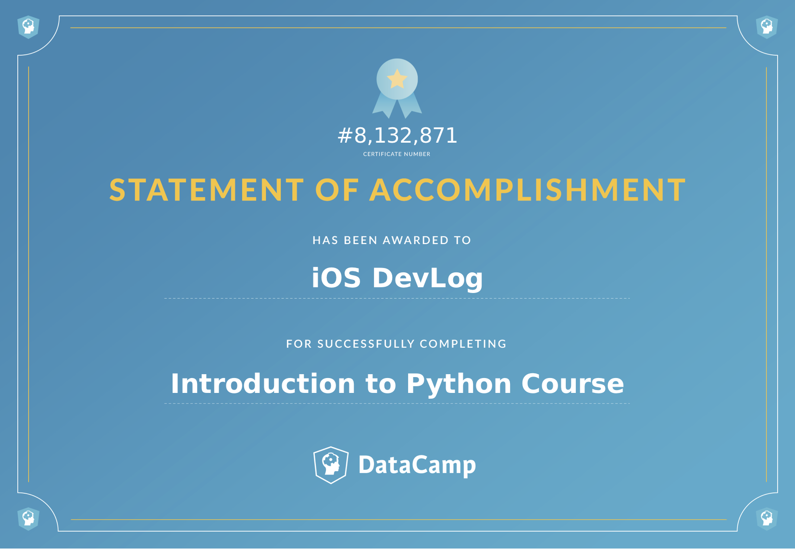

# Course Description

Python is a general-purpose programming language that is becoming more and more popular for doing data science. Companies worldwide are using Python to harvest insights from their data and get a competitive edge. Unlike any other Python tutorial, this course focuses on Python specifically for data science. In our Intro to Python class, you will learn about powerful ways to store and manipulate data as well as cool data science tools to start your own analyses. Enter DataCamp’s online Python curriculum.

Python是一种通用编程语言，在进行数据科学时越来越受欢迎。 世界各地的公司都在使用Python从数据中获取洞察力并获得竞争优势。 与任何其他Python教程不同，本课程专注于专门用于数据科学的Python。 在我们的Python入门课程中，您将学习存储和操作数据的强大方法，以及用于开始自己分析的酷数据科学工具。 输入DataCamp的在线Python课程。

## Python Basics

An introduction to the basic concepts of Python. Learn how to use Python both interactively and through a script. Create your first variables and acquaint yourself with Python's basic data types.

介绍Python的基本概念。 了解如何以交互方式和脚本方式使用Python。 创建您的第一个变量并熟悉Python的基本数据类型。


### Hello Python!

50 xp


### The Python Interface

100 xp

code

```python
# Example, do not modify!
print(5 / 8)

# Put code below here
print(7 + 10)
```

output

```python
0.625
17
```


### When to use Python?

50 xp

answer

```python
All of the above
```


### Any comments?

100 xp

code

```python
# Division
print(5 / 8)

# Addition
print(7 + 10)
```

output

```python
0.625
17
```


### Python as a calculator

100 xp

code

```python
# Addition, subtraction
print(5 + 5)
print(5 - 5)

# Multiplication, division, modulo, and exponentiation
print(3 * 5)
print(10 / 2)
print(18 % 7)
print(4 ** 2)

# How much is your $100 worth after 7 years?
print(100*1.1**7)
```

output

```python
10
0
15
5.0
4
16
194.87171000000012
```


### Variables & Types

50 xp


### Variable Assignment

100 xp

code

```python
# Create a variable savings
savings = 100

# Print out savings
print(savings)
```

output

```python
100
```


### Calculations with variables

100 xp

code

```python
# Create a variable savings
savings = 100

# Create a variable growth_multiplier
growth_multiplier = 1.1

# Calculate result
result = savings * growth_multiplier ** 7

# Print out result
print(result)
```

output

```python
194.87171000000012
```


### Other variable types

100 xp

code

```python
# Create a variable desc
desc = "compound interest"

# Create a variable profitable
profitable = True
```


### Guess the type

50 xp

answer

```pytyhon
a is of type float, b is of type str, c is of type bool
```


### Operations with other types

100 xp

code

```python
savings = 100
growth_multiplier = 1.1
desc = "compound interest"

# Assign product of growth_multiplier and savings to year1
year1 = savings * growth_multiplier

# Print the type of year1
print(type(year1))

# Assign sum of desc and desc to doubledesc
doubledesc = desc + desc

# Print out doubledesc
print(doubledesc)
```

output

```python
<class 'float'>
compound interestcompound interest
```


### Type conversion

100 xp

code

```python
# Definition of savings and result
savings = 100
result = 100 * 1.10 ** 7

# Fix the printout
print("I started with $" + str(savings) + " and now have $" + str(result) + ". Awesome!")

# Definition of pi_string
pi_string = "3.1415926"

# Convert pi_string into float: pi_float
pi_float = float(pi_string)
```

output

```python
I started with $100 and now have $194.87171000000012. Awesome!
```


### Can Python handle everything?

50 xp

answer

```python
"The correct answer to this multiple choice exercise is answer number " + 2
```

## Python Lists

Learn to store, access and manipulate data in lists: the first step towards efficiently working with huge amounts of data.

学习存储，访问和操作列表中的数据：有效处理大量数据的第一步。


### Lists, what are they?

50 xp


### Create a list

100 xp

code

```python
# area variables (in square meters)
hall = 11.25
kit = 18.0
liv = 20.0
bed = 10.75
bath = 9.50

# Create list areas
areas = [hall, kit, liv, bed, bath]

# Print areas
print(areas)
```

output

```python
[11.25, 18.0, 20.0, 10.75, 9.5]
```


### Create list with different types

100 xp

code

```python
# area variables (in square meters)
hall = 11.25
kit = 18.0
liv = 20.0
bed = 10.75
bath = 9.50

# Adapt list areas
areas = ["hallway", hall, "kitchen", kit, "living room", liv, "bedroom", bed, "bathroom", bath]

# Print areas
print(areas)
```

output

```python
['hallway', 11.25, 'kitchen', 18.0, 'living room', 20.0, 'bedroom', 10.75, 'bathroom', 9.5]
```


### Select the valid list

50 xp

answer

```python
A, B and C
```


### List of lists

100 xp

code

```python
# area variables (in square meters)
hall = 11.25
kit = 18.0
liv = 20.0
bed = 10.75
bath = 9.50

# house information as list of lists
house = [["hallway", hall],
         ["kitchen", kit],
         ["living room", liv],
         ["bedroom", bed],
         ["bathroom", bath]]

# Print out house
print(house)

# Print out the type of house
print(type(house))
```

output

```python
[['hallway', 11.25], ['kitchen', 18.0], ['living room', 20.0], ['bedroom', 10.75], ['bathroom', 9.5]]
<class 'list'>
```


### Subsetting lists

50 xp


### Subset and conquer

100 xp

code

```python
# Create the areas list
areas = ["hallway", 11.25, "kitchen", 18.0, "living room", 20.0, "bedroom", 10.75, "bathroom", 9.50]

# Print out second element from areas
print(areas[1])

# Print out last element from areas
print(areas[-1])

# Print out the area of the living room
print(areas[5])
```

output

```python
11.25
9.5
20.0
```


### Subset and calculate

100 xp

code

```python
# Create the areas list
areas = ["hallway", 11.25, "kitchen", 18.0, "living room", 20.0, "bedroom", 10.75, "bathroom", 9.50]

# Sum of kitchen and bedroom area: eat_sleep_area
eat_sleep_area = areas[3] + areas[7]

# Print the variable eat_sleep_area
print(eat_sleep_area)
```

output

```python
28.75
```


### Slicing and dicing

100 xp

code

```python
# Create the areas list
areas = ["hallway", 11.25, "kitchen", 18.0, "living room", 20.0, "bedroom", 10.75, "bathroom", 9.50]

# Use slicing to create downstairs
downstairs = areas[:6]

# Use slicing to create upstairs
upstairs = areas[-4:]

# Print out downstairs and upstairs
print(downstairs)
print(upstairs)
```

output

```python
['hallway', 11.25, 'kitchen', 18.0, 'living room', 20.0]
['bedroom', 10.75, 'bathroom', 9.5]
```


### Slicing and dicing (2)

100 xp

code

```python
# Create the areas list
areas = ["hallway", 11.25, "kitchen", 18.0, "living room", 20.0, "bedroom", 10.75, "bathroom", 9.50]

# Alternative slicing to create downstairs
downstairs = areas[:6]

# Alternative slicing to create upstairs
upstairs = areas[-4:]
```


### Subsetting lists of lists

50 xp

answer

```python
A float: the bathroom area
```


### List Manipulation

50 xp


### Replace list elements

100 xp

code

```python
# Create the areas list
areas = ["hallway", 11.25, "kitchen", 18.0, "living room", 20.0, "bedroom", 10.75, "bathroom", 9.50]

# Correct the bathroom area
areas[-1] = 10.50

# Change "living room" to "chill zone"
areas[4] = "chill zone"
```


### Extend a list

100 xp

code:

```python
# Create the areas list and make some changes
areas = ["hallway", 11.25, "kitchen", 18.0, "chill zone", 20.0,
         "bedroom", 10.75, "bathroom", 10.50]

# Add poolhouse data to areas, new list is areas_1
areas_1 = areas + ["poolhouse", 24.5]

# Add garage data to areas_1, new list is areas_2
areas_2 = areas_1 + ["garage", 15.45]
```


### Delete list elements

50 xp

answer

```python
del(areas[-4:-2])
```


### Inner workings of lists

100 xp

code

```python
# Create list areas
areas = [11.25, 18.0, 20.0, 10.75, 9.50]

# Create areas_copy
areas_copy = areas[:]

# Change areas_copy
areas_copy[0] = 5.0

# Print areas
print(areas)
```

output

```python
[11.25, 18.0, 20.0, 10.75, 9.5]
```

## Functions and Packages

To leverage the code that brilliant Python developers have written, you'll learn about using functions, methods and packages. This will help you to reduce the amount of code you need to solve challenging problems!

要利用优秀Python开发人员编写的代码，您将学习如何使用函数，方法和包。 这将帮助您减少解决具有挑战性问题所需的代码量！


### Functions

50 xp


### Familiar functions

100 xp

code

```python
# Create variables var1 and var2
var1 = [1, 2, 3, 4]
var2 = True

# Print out type of var1
print(type(var1))

# Print out length of var1
print(len(var1))

# Convert var2 to an integer: out2
out2 = int(var2)
```

output

```python
<class 'list'>
4
```


### Help!

50 xp

answer

```python
complex() takes two arguments: real and imag. real is a required argument, imag is an optional argument.
```


### Multiple arguments

100 xp

code

```python
# Create lists first and second
first = [11.25, 18.0, 20.0]
second = [10.75, 9.50]

# Paste together first and second: full
full = first + second

# Sort full in descending order: full_sorted
full_sorted = sorted(full, reverse=True)

# Print out full_sorted
print(full_sorted)
```

output

```python
[20.0, 18.0, 11.25, 10.75, 9.5]
```


### Methods

50 xp


### String Methods

100 xp

code

```python
# string to experiment with: place
place = "poolhouse"

# Use upper() on place: place_up
place_up = place.upper()

# Print out place and place_up
print(place)
print(place_up)

# Print out the number of o's in place
print(place.count('o'))
```

output

```python
poolhouse
POOLHOUSE
3
```


### List Methods

100 xp

code

```python
# Create list areas
areas = [11.25, 18.0, 20.0, 10.75, 9.50]

# Print out the index of the element 20.0
print(areas.index(20.0))

# Print out how often 9.50 appears in areas
print(areas.count(9.50))
```

output

```python
2
1
```


### List Methods (2)

100 xp

code

```python
# Create list areas
areas = [11.25, 18.0, 20.0, 10.75, 9.50]

# Use append twice to add poolhouse and garage size
areas.append(24.5)
areas.append(15.45)


# Print out areas
print(areas)

# Reverse the orders of the elements in areas
areas.reverse()

# Print out areas
print(areas)
```

output

```python
[11.25, 18.0, 20.0, 10.75, 9.5, 24.5, 15.45]
[15.45, 24.5, 9.5, 10.75, 20.0, 18.0, 11.25]
```


### Packages

50 xp


### Import package

100 xp

code

```python
# Definition of radius
r = 0.43

# Import the math package
import math

# Calculate C
C = 2 * math.pi * r

# Calculate A
A = math.pi * r ** 2

# Build printout
print("Circumference: " + str(C))
print("Area: " + str(A))
```

output

```python
Circumference: 2.701769682087222
Area: 0.5808804816487527
```


### Selective import

100 xp

code

```python
# Definition of radius
r = 192500

# Import radians function of math package
from math import radians

# Travel distance of Moon over 12 degrees. Store in dist.
dist = r * radians(12)

# Print out dist
print(dist)
```

output

```python
40317.10572106901
```


### Different ways of importing

50 xp

answer

```python
from scipy.linalg import inv as my_inv
```

## NumPy

NumPy is a Python package to efficiently do data science. Learn to work with the NumPy array, a faster and more powerful alternative to the list, and take your first steps in data exploration.

NumPy是一个有效地进行数据科学的Python包。 学习使用NumPy阵列，这是列表的更快，更强大的替代方案，并在数据探索中迈出第一步。


### NumPy

50 xp


### Your First NumPy Array

100 xp

code

```python
# Create list baseball
baseball = [180, 215, 210, 210, 188, 176, 209, 200]

# Import the numpy package as np
import numpy as np

# Create a numpy array from baseball: np_baseball
np_baseball = np.array(baseball)

# Print out type of np_baseball
print(type(np_baseball))
```

output

```python
<class 'numpy.ndarray'>
```


### Baseball players' height

100 xp

code

```python
# height is available as a regular list

# Import numpy
import numpy as np

# Create a numpy array from height_in: np_height_in
np_height_in = np.array(height_in)

# Print out np_height_in
print(np_height_in)

# Convert np_height_in to m: np_height_m
np_height_m = np_height_in * 0.0254

# Print np_height_m
print(np_height_m)
```

output

```python
[74 74 72 ..., 75 75 73]
[ 1.8796  1.8796  1.8288 ...,  1.905   1.905   1.8542]
```


### Baseball player's BMI

100 xp

code

```python
# height and weight are available as regular lists

# Import numpy
import numpy as np

# Create array from height_in with metric units: np_height_m
np_height_m = np.array(height_in) * 0.0254

# Create array from weight_lb with metric units: np_weight_kg
np_weight_kg = np.array(weight_lb) * 0.453592

# Calculate the BMI: bmi
bmi = np_weight_kg / np_height_m ** 2

# Print out bmi
print(bmi)
```

output

```python
[ 23.11037639  27.60406069  28.48080465 ...,  25.62295933  23.74810865
  25.72686361]
```


### Lightweight baseball players

100 xp

code

```python
# height and weight are available as a regular lists

# Import numpy
import numpy as np

# Calculate the BMI: bmi
np_height_m = np.array(height_in) * 0.0254
np_weight_kg = np.array(weight_lb) * 0.453592
bmi = np_weight_kg / np_height_m ** 2

# Create the light array
light = bmi < 21

# Print out light
print(light)

# Print out BMIs of all baseball players whose BMI is below 21
print(bmi[light])
```

output

```python
[False False False ..., False False False]
[ 20.54255679  20.54255679  20.69282047  20.69282047  20.34343189
  20.34343189  20.69282047  20.15883472  19.4984471   20.69282047
  20.9205219 ]
```


### NumPy Side Effects

50 xp

answer

```python
np.array([4, 3, 0]) + np.array([0, 2, 2])
```


### Subsetting NumPy Arrays

100 xp

code

```python
# height and weight are available as a regular lists

# Import numpy
import numpy as np

# Store weight and height lists as numpy arrays
np_weight_lb = np.array(weight_lb)
np_height_in = np.array(height_in)

# Print out the weight at index 50
print(np_weight_lb[50])

# Print out sub-array of np_height_in: index 100 up to and including index 110
print(np_height_in[100:111])
```

output

```python
200
[73 74 72 73 69 72 73 75 75 73 72]
```


### 2D NumPy Arrays

50 xp


### Your First 2D NumPy Array

100 xp

code

```python
# Create baseball, a list of lists
baseball = [[180, 78.4],
            [215, 102.7],
            [210, 98.5],
            [188, 75.2]]

# Import numpy
import numpy as np

# Create a 2D numpy array from baseball: np_baseball
np_baseball = np.array(baseball)

# Print out the type of np_baseball
print(type(np_baseball))

# Print out the shape of np_baseball
print(np_baseball.shape)
```

output

```python
<class 'numpy.ndarray'>
(4, 2)
```


### Baseball data in 2D form

100 xp

code

```python
# baseball is available as a regular list of lists

# Import numpy package
import numpy as np

# Create a 2D numpy array from baseball: np_baseball
np_baseball = np.array(baseball)

# Print out the shape of np_baseball
print(np_baseball.shape)
```

output

```python
(1015, 2)
```


### Subsetting 2D NumPy Arrays

100 xp

code

```python
# baseball is available as a regular list of lists

# Import numpy package
import numpy as np

# Create np_baseball (2 cols)
np_baseball = np.array(baseball)

# Print out the 50th row of np_baseball
print(np_baseball[49, :])

# Select the entire second column of np_baseball: np_weight_lb
np_weight_lb = np_baseball[:, 1]

# Print out height of 124th player
print(np_baseball[123, 0])
```

output

```python
[ 70 195]
75
```


### 2D Arithmetic

100 xp

code

```python
# baseball is available as a regular list of lists
# updated is available as 2D numpy array

# Import numpy package
import numpy as np

# Create np_baseball (3 cols)
np_baseball = np.array(baseball)

# Print out addition of np_baseball and updated
print(np_baseball + updated)

# Create numpy array: conversion
conversion = np.array([0.0254, 0.453592, 1])

# Print out product of np_baseball and conversion
print(np_baseball * conversion)
```

output

```python
[[  75.2303559   168.83775102   23.99      ]
 [  75.02614252  231.09732309   35.69      ]
 [  73.1544228   215.08167641   31.78      ]
 ...,
 [  76.09349925  209.23890778   26.19      ]
 [  75.82285669  172.21799965   32.01      ]
 [  73.99484223  203.14402711   28.92      ]]
[[  1.8796   81.64656  22.99   ]
 [  1.8796   97.52228  34.69   ]
 [  1.8288   95.25432  30.78   ]
 ...,
 [  1.905    92.98636  25.19   ]
 [  1.905    86.18248  31.01   ]
 [  1.8542   88.45044  27.92   ]]
```


### NumPy: Basic Statistics

50 xp


### Average versus median

100 xp

code

```python
# np_baseball is available

# Import numpy
import numpy as np

# Create np_height_in from np_baseball
np_height_in = np_baseball[:, 0]

# Print out the mean of np_height_in
print(np.mean(np_height_in))

# Print out the median of np_height_in
print(np.median(np_height_in))
```

output

```python
1586.46108374
74.0
```


### Explore the baseball data

100 xp

code

```python
# np_baseball is available

# Import numpy
import numpy as np

# Print mean height (first column)
avg = np.mean(np_baseball[:,0])
print("Average: " + str(avg))

# Print median height. Replace 'None'
med = np.median(np_baseball[:, 0])
print("Median: " + str(med))

# Print out the standard deviation on height. Replace 'None'
stddev = np.std(np_baseball[:, 0])
print("Standard Deviation: " + str(stddev))

# Print out correlation between first and second column. Replace 'None'
corr = np.corrcoef(np_baseball[:, 0], np_baseball[:, 1])
print("Correlation: " + str(corr))
```

output

```python
Average: 73.6896551724
Median: 74.0
Standard Deviation: 2.31279188105
Correlation: [[ 1.          0.53153932]
 [ 0.53153932  1.        ]]
```


### Blend it all together

100 xp

code

```python
# heights and positions are available as lists

# Import numpy
import numpy as np

# Convert positions and heights to numpy arrays: np_positions, np_heights
np_heights = np.array(heights)
np_positions = np.array(positions)

# Heights of the goalkeepers: gk_heights
gk_heights = np_heights[np_positions == 'GK']

# Heights of the other players: other_heights
other_heights = np_heights[np_positions != 'GK']

# Print out the median height of goalkeepers. Replace 'None'
print("Median height of goalkeepers: " + str(np.median(gk_heights)))

# Print out the median height of other players. Replace 'None'
print("Median height of other players: " + str(np.median(other_heights)))
```

output

```python
Median height of goalkeepers: 188.0
Median height of other players: 181.0
```

## STATEMENT OF ACCOMPLISHMENT

